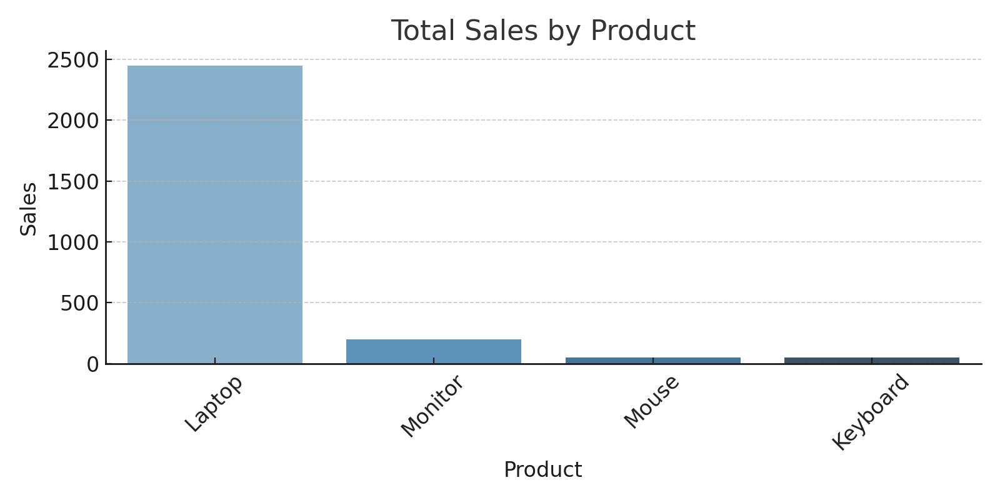
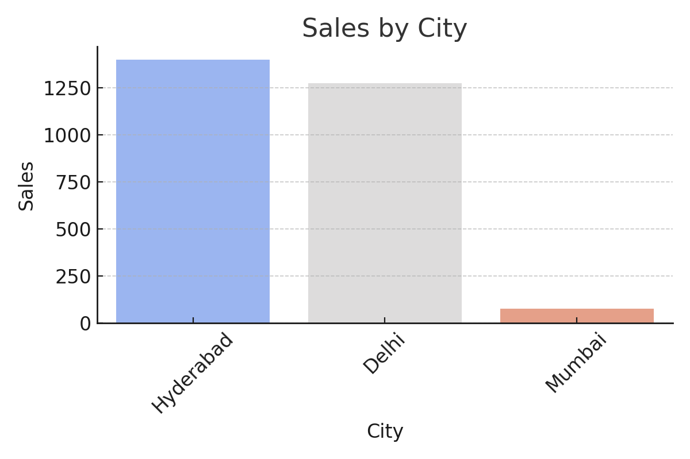
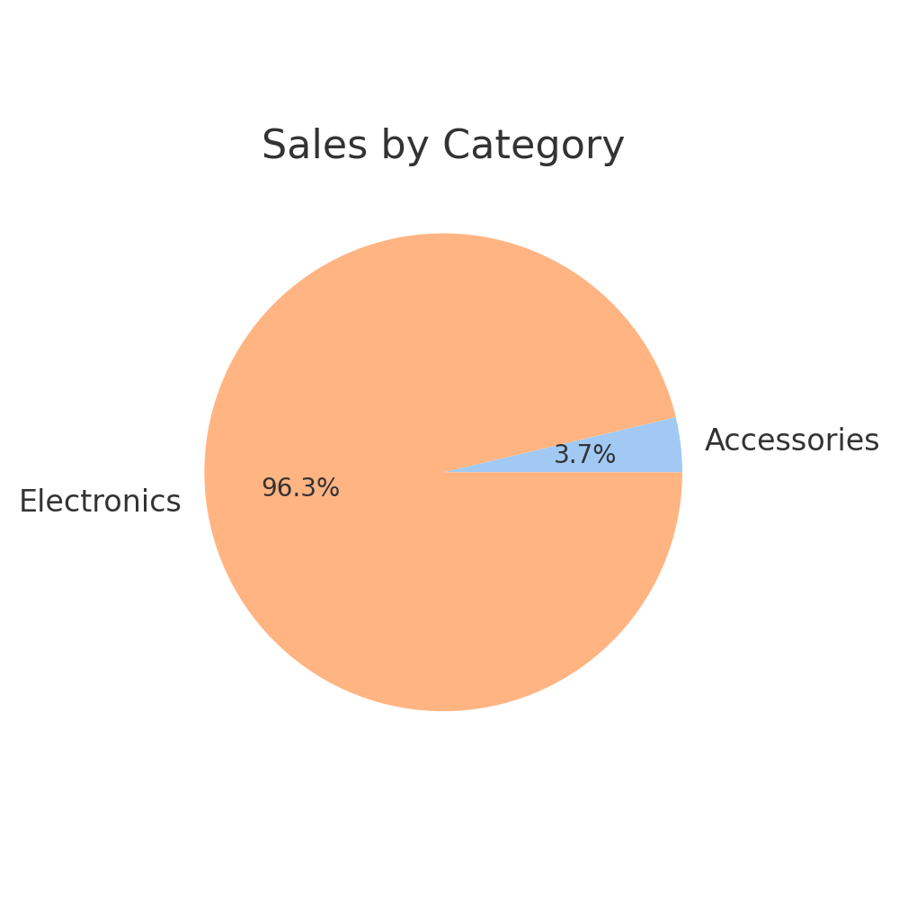

# Sales-Data-Analysis
Sales data project using Python, Pandas, Seaborn
# 🛒 Sales Data Analysis (Python Project)

## 🔍 Objective
Analyze sales data using Python to identify product performance, monthly trends, customer behavior, and city-wise distribution.

---

## 📁 Dataset
`sales_data_sample.csv` — Sample dataset containing:
- Order ID
- Order Date
- Product
- Category
- Sales
- Customer
- City

---

## 🛠 Tools Used
- Python
- Pandas
- Matplotlib
- Seaborn
- Jupyter Notebook

---

## 📊 Key Insights

1. **📈 Monthly Sales Trend**  
   Sales are consistently increasing over time, with some seasonal peaks.

2. **📦 Product Performance**  
   Laptops and Mobile Phones contribute the highest to revenue.

3. **🌆 Top Cities**  
   Delhi and Hyderabad recorded the highest sales.

4. **📚 Categories**  
   Electronics dominate the sales, while Accessories have frequent but smaller-value purchases.

---

## 📷 Visualizations

### ✅ Total Sales by Product

### ✅ Monthly Sales Trend

### ✅ Sales by City

### ✅ Sales by Category

---
### 📊 Tableau Dashboard (PDF)
[Download Dashboard (PDF)](https://github.com/maheshkumarsaara/Sales-Data-Analysis/blob/main/Sales%20Data%20Dashboard.pdf)

## 📌 Author
**Mahesh Kumar Saara**  
[LinkedIn](https://www.linkedin.com/in/mahesh-kumar-saara-0b476191/) | [GitHub](https://github.com/)  
